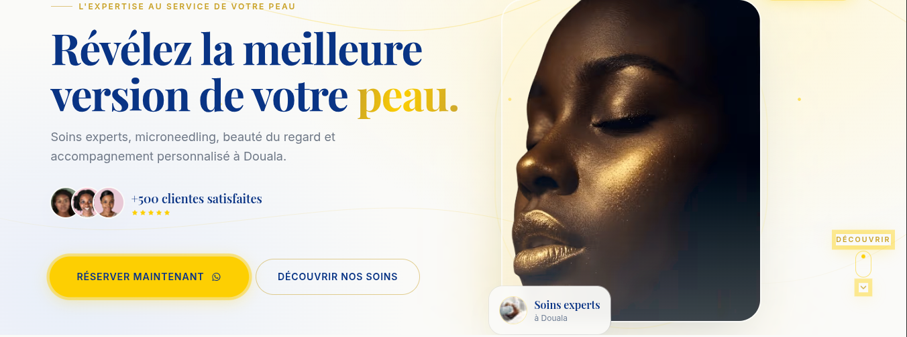

<div align="center">

# Cynthia Cosmétique

**L'expertise au service de votre peau et de votre beauté naturelle.**

Site vitrine premium pour un institut de beauté haut de gamme basé à Douala, Cameroun.

[](https://nextjs.org)
[](https://react.dev)
[](https://tailwindcss.com)
[](https://typescriptlang.org)

</div>

---



---

## ✨ Fonctionnalités

- **Design premium** — Charte graphique soignée (or luxury, bleu royal, ivoire)
- **Animations fluides** — Framer Motion avec easing luxe `cubic-bezier(0.22, 1, 0.36, 1)`
- **Chargement intelligent** — Code splitting dynamique, animations de loading en cascade
- **Responsive** — Mobile-first, adapté à tous les écrans
- **Accessibilité** — Labels ARIA, `:focus-visible`, `prefers-reduced-motion`
- **SEO** — Metadata, Open Graph, JSON-LD structuré (BeautySalon)
- **Léger** — Zéro dépendance inutile, bundle optimisé

## 🛠 Stack technique

| Technologie | Rôle |
|---|---|
| Next.js 16 | Framework React (App Router, Turbopack) |
| React 19 | UI library |
| Tailwind CSS v4 | Styling (design tokens via `@theme`) |
| Framer Motion | Animations & interactions |
| TypeScript 5 | Typage statique |
| Biome | Lint & format |
| Lucide React | Iconographie |

## 🚀 Démarrage rapide

```bash
# Cloner le dépôt
git clone https://github.com/votre-user/cynthia.git
cd cynthia

# Installer les dépendances
npm install

# Lancer le serveur de développement
npm run dev
```

Ouvrir [http://localhost:3000](http://localhost:3000).

## 📦 Scripts disponibles

```bash
npm run dev       # Serveur de développement (Turbopack)
npm run build     # Build de production
npm run start     # Lancer le build de production
npm run lint      # Vérifier le code (Biome)
npm run lint:fix  # Corriger automatiquement
npm run format    # Formater le code
```

## 🎨 Charte graphique

### Palette

| Rôle | HEX | Usage |
|---|---|---|
| Bleu Royal | `#093485` | Structure, titres, navigation |
| Or Luxury | `#FDCF02` | Accent, CTA, highlights (≤10%) |
| Or Profond | `#C9A227` | Texte doré sur fond clair |
| Ivoire | `#FAFAF8` | Fond principal |
| Crème | `#F7F3EA` | Sections chaudes, cartes |
| Ardoise | `#4A5568` | Corps de texte |

### Règle absolue

> **Le noir (#000) est proscrit. Aucune zone sombre.**

### Polices

- **Display** — Playfair Display (serif, éditorial)
- **Interface** — Inter (sans-serif, navigation, body)

## 📁 Structure du projet

```
cynthia/
├── app/
│   ├── globals.css          # Design tokens + utilities
│   ├── layout.tsx           # Root layout (fonts, metadata, JSON-LD)
│   ├── page.tsx             # Home — sections dynamiques
│   ├── not-found.tsx        # Page 404
│   ├── a-propos/page.tsx    # À propos
│   ├── contact/page.tsx     # Contact
│   └── prestation/page.tsx  # Prestations
├── components/
│   ├── ui/                  # Primitives réutilisables
│   │   ├── Button.tsx
│   │   ├── Filaments.tsx
│   │   ├── Reveal.tsx
│   │   ├── SectionHeading.tsx
│   │   ├── Stars.tsx
│   │   └── WhatsAppIcon.tsx
│   ├── Navbar.tsx
│   ├── Hero.tsx
│   ├── Loader.tsx           # Splash screen SVG animé
│   ├── FeaturedTreatments.tsx
│   ├── SkinConcerns.tsx
│   ├── Transformation.tsx
│   ├── Expertise.tsx
│   ├── Testimonials.tsx
│   ├── Explore.tsx
│   ├── FAQ.tsx
│   └── Footer.tsx
├── lib/
│   ├── site.ts              # Config & contenu
│   └── utils.ts             # cn() utility
└── public/
    └── assets/images/       # Images du site
```

## 🌍 Pages

| Route | Description |
|---|---|
| `/` | Accueil — Hero, soins, expertise, témoignages, FAQ |
| `/prestation` | Catalogue de prestations |
| `/a-propos` | Histoire & expertise |
| `*` | Page 404 avec animation 404 dorée |

## 📄 Licence

Projet privé — Cynthia Cosmétique. Tous droits réservés.

---

<div align="center">

Développé avec passion pour **Cynthia Cosmétique**

</div>
